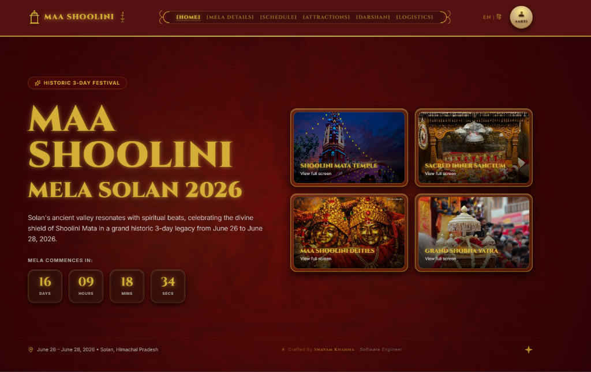
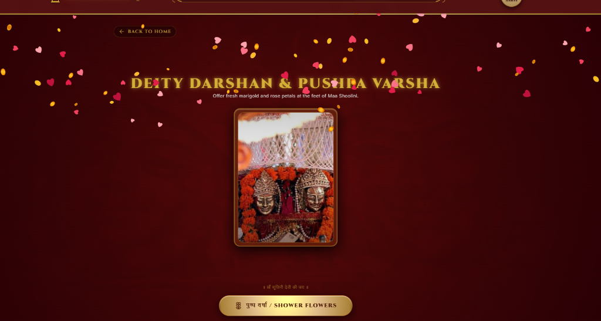

<div align="center">

# 🪔 Maa Shoolini Fair 2026

### *A premium devotional web experience — built for the grandest festival of Solan, Himachal Pradesh.*

[](https://nextjs.org)
[](https://typescriptlang.org)
[](https://tailwindcss.com)
[](https://framer.com/motion)
[](LICENSE)
[](#)

> *॥ जय माँ शूलिनी ॥*

</div>

---

## 📸 Screenshots

### 🏠 Home — Hero Section
> Live countdown timer · Gold-framed photo gallery · Bilingual toggle · Developer credit



---

### 🌸 Darshan — Pushp Varsha (पुष्प वर्षा)
> Tap **"पुष्प वर्षा / Shower Flowers"** and watch rose petals & marigolds rain down across the entire screen at 60 fps



---

## ✨ Features

| Feature | Description |
|---|---|
| 🕐 **Live Countdown Timer** | Real-time countdown to June 26, 2026 — updates every second |
| 🌸 **Pushp Varsha (पुष्प वर्षा)** | Full-screen Canvas particle shower — rose petals & marigolds at 60 fps |
| 🚗 **Live Smart Parking Map** | Interactive Leaflet.js map with Solan's main hubs and real-time color-coded occupancy tracking |
| 🚥 **Transit Corridors** | Congestion tracking for major entry gates (Chambaghat, Saproon, Bypass, Rajgarh) |
| 📡 **IoT Sensor Simulator** | Built-in developer dashboard to trigger mock sensor pings and test live updates |
| 🍲 **Himachali Food Guide** | Authentic local cuisine directory with dynamic budget calculator & walk itinerary builder |
| 🪔 **Sacred Darshan Stage** | Deity portrait in double gold-rimmed frame with inner vignette & filigree |
| 🎡 **Medallion Event Slider** | Horizontal snap-scroll carousel with floating gold diamond nav buttons |
| 🖼️ **Photo Lightbox Gallery** | Click-to-expand gold-framed gallery with backdrop blur |
| 🌐 **Bilingual (EN / हिं)** | Full English ↔ Hindi toggle across all pages |
| 📱 **Fully Responsive** | Mobile-first layout with smooth transitions, tested 320 px → 1920 px |
| ⚡ **Static Pre-rendering** | Pre-rendered static routing mixed with client-side dynamic database integrations |
| 🎶 **Aarti Drawer** | Devotional Aarti side panel with animated diya |
| 🗓️ **3-Day Schedule** | Complete event schedule with filterable categories |
| 🗺️ **Visitor Info** | Transport, accommodation, emergency helpdesks & FAQ |

---

## 🗂️ Project Structure

```
MaaShoolini_Project/
├── public/
│   ├── deities.jpg              # Maa Shoolini sacred deity photograph
│   ├── temple.png               # Shoolini Mata Temple hero image
│   ├── hero-bg.jpg              # Background texture
│   └── screenshots/
│       ├── home.png             # Home page screenshot
│       └── darshan.png          # Darshan + flower shower screenshot
└── src/
    ├── app/
    │   ├── page.tsx             # 🏠 Home
    │   ├── layout.tsx           # Root layout + Google Fonts
    │   ├── globals.css          # Design tokens & keyframe animations
    │   ├── darshan/             # 🌸 Darshan + Pushp Varsha
    │   ├── attractions/         # Fair attractions & highlights
    │   ├── devotional-wall/     # Devotee blessings wall
    │   ├── food/                # 🍲 Food Fest Guide
    │   ├── mela-details/        # History & significance
    │   ├── parking/             # 🚗 Live Smart Parking Finder (Map view)
    │   ├── schedule/            # 3-day event schedule
    │   ├── transportation/      # 🚌 Automated Sensor Parking (List view)
    │   ├── visitor-info/        # Travel, stay & FAQs
    │   └── api/                 # Backend API routes for parking & food
    └── components/
        ├── Hero.tsx             # Hero section (countdown, gallery)
        ├── Navbar.tsx           # Top navigation bar
        ├── DarshanStage.tsx     # 🌸 Full-screen canvas flower shower
        ├── MedallionSlider.tsx  # Horizontal snap-scroll carousel
        ├── FoodFestCalculator.tsx # 🍲 Interactive food guide & route planner
        ├── ParkingFinder.tsx    # 🚗 Leaflet Map & Parking Simulator
        ├── AartiDrawer.tsx      # Aarti devotional panel
        ├── Footer.tsx           # Site footer
        ├── LanguageToggle.tsx   # EN ↔ हिं toggle
        ├── Attractions.tsx      # Attraction feature cards
        ├── Timeline.tsx         # Schedule timeline component
        └── VisitorInfo.tsx      # Visitor info with Live Parking Finder link
```

---

## 🚀 Getting Started

### Prerequisites
- Node.js `>= 18.x`
- npm `>= 9.x`

### Installation & Development

```bash
# Clone the repository
git clone https://github.com/Swayam-Khanna/Maa_Shoolini_Fair_2026.git
cd Maa_Shoolini_Fair_2026

# Install dependencies
npm install

# Start the development server
npm run dev
```

Open [http://localhost:3000](http://localhost:3000) in your browser 🙏

### Production Build

```bash
npm run build   # Generates static output
npm start       # Serves production build locally
```

> All 8 routes pre-render as static HTML — deploy directly to Vercel, Netlify, or any static host.

---

## 🌸 Pushp Varsha — Technical Deep Dive

The flower shower on `/darshan` is built with a hand-crafted **HTML5 Canvas 2D particle engine**:

```
• Zero runtime dependencies — pure Canvas 2D API
• 90 petals per burst (mix of teardrop rose petals + oval marigold discs)
• Physics: gravity (vy), sinusoidal sway, per-petal angular rotation
• Colour palettes: 5 rose reds + 5 marigold ambers, randomly sampled
• Fade-out zone: petals gracefully fade in the bottom 20% of viewport
• rAF lifecycle: loop auto-cancels when canvas is empty (zero idle cost)
• DPR-aware: crisp rendering on all HiDPI / Retina displays
• Canvas is fixed inset-0 (pointer-events: none) — covers full screen
```

---

## 🚗 Smart Parking & Live Transit Architecture

The dynamic parking finder on `/parking` and automated sensor dashboard on `/transportation` are built using a hybrid real-time design:

```
• Live Database Sync: Polls /api/parking/live every 4 seconds to sync active slots with MongoDB.
• High-Performance Map: Uses viewport-aware single Leaflet instance lifecycle hooks to prevent memory leaks and handle resizing smoothly.
• Mobile-Optimized Grid: Consolidation into a single CSS grid with responsive map bounds (260px on mobile to 520px on desktop) to optimize mobile rendering.
• Hardware-Accelerated UI: Occupancy bars and panels employ transform-gpu and will-change-transform for native-feeling 60-120fps animations.
• Predictive Model fallback: Built-in local temporal simulation adjusts counts dynamically based on time-of-day traffic patterns.
```

---

## 🛠️ Tech Stack

| Technology | Version | Purpose |
|---|---|---|
| **Next.js** | 16.2.7 | Framework, App Router, hybrid static/dynamic |
| **TypeScript** | 5.x | Full type safety |
| **Tailwind CSS** | 3.x | Utility-first design system & GPU transitions |
| **Leaflet & React-Leaflet** | Latest | High-performance interactive map plotting |
| **Framer Motion** | Latest | Transitions & iOS-style fluid UI micro-animations |
| **HTML5 Canvas API** | Native | 60 fps full-screen particle system |
| **Lucide React** | Latest | Icon system |
| **Google Fonts** | — | Cinzel Decorative · Inter · Noto Sans Devanagari |

---

## 📄 Routes

| Route | Page |
|---|---|
| `/` | Home – Hero, countdown, gallery, event slider |
| `/darshan` | 🌸 Sacred Darshan + Pushp Varsha flower shower |
| `/parking` | 🚗 Live Smart Parking Finder (Interactive Map & Corridor Congestion) |
| `/transportation` | 🚌 Automated Sensor Parking (Real-time live list polling MongoDB) |
| `/food` | 🍲 Himachali Food Fest Guide & Route Planner |
| `/attractions` | Highlights & activities |
| `/schedule` | 3-day event schedule (June 26–28) |
| `/mela-details` | History & significance of Maa Shoolini Mela |
| `/devotional-wall` | Devotee blessings & messages |
| `/visitor-info` | Transport, stay, emergency helpdesks & FAQs |

---

## 🙏 Credits

<div align="center">

| | |
|---|---|
| 👨‍💻 **Developer** | **Swayam Khanna** — Software Engineer |
| 🎨 **Design System** | Custom premium dark-mode gold-crimson UI |
| 📸 **Photography** | Sacred photographs of Maa Shoolini Deities, Solan |
| 🏔️ **Inspired by** | The divine Maa Shoolini Devi Mela, Solan, Himachal Pradesh |

</div>

---

<div align="center">

**॥ जय माँ शूलिनी ॥**

Made with ❤️ & devotion by **[Swayam Khanna](https://github.com/Swayam-Khanna)**

*© 2026 Maa Shoolini Fair. All rights reserved.*

</div>
